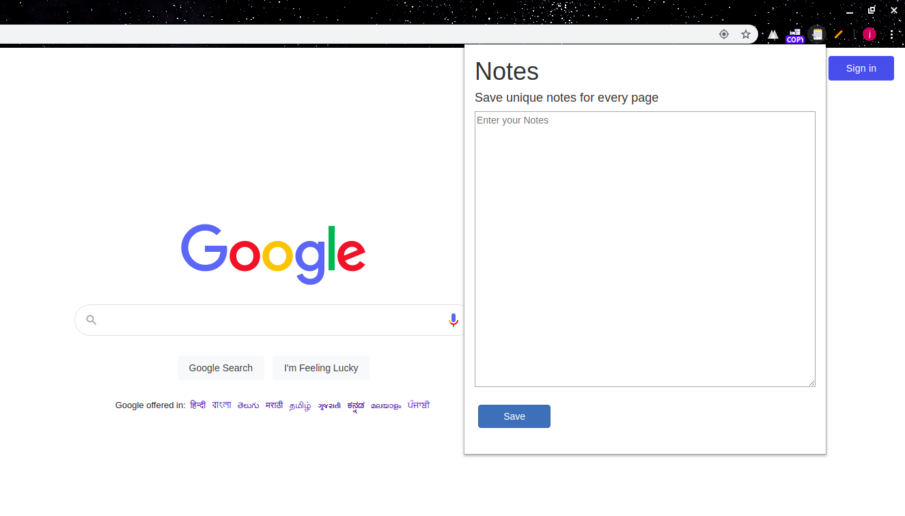

# Notes-Chrome Extension

Most note takng applications are too complex these days.Very Distracting!
 Here is a simple notes taking app that lets you concentrate on writing your notes rather than the million other features that other plugins provide :)

 Checkout my Medium article: https://jainil-parikh.medium.com/build-your-custom-notes-chrome-extension-90ac618b345e

 Steps to install:

 1. Open Chrome settings on the top right corner and select Extensions.

 2. Enable developer mode.

 3. Click on load unpacked Extension and select the folder where you have downloaded the git repo.

 The extension is now installed and can be seen at chrome://extensions/ .

# Notes Extension
 

# References

1. https://developer.chrome.com/docs/extensions/mv3/getstarted/

2. 
Icons made by <a href="https://www.freepik.com" title="Freepik">Freepik</a> from <a href="https://www.flaticon.com/" title="Flaticon">www.flaticon.com</a>

